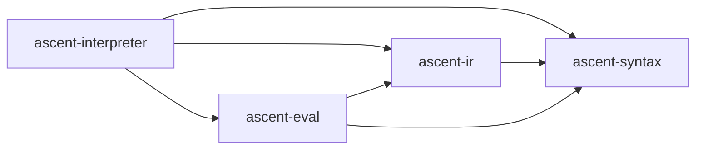
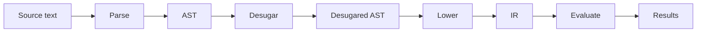

# Architecture

This page describes how the interpreter is organized and how data flows from source text to evaluated results.

## Crate Structure

| Crate | Purpose |
|-------|---------|
| `ascent-syntax` | Parser (syn-based) and desugaring passes |
| `ascent-ir` | Intermediate representation, lowered from AST |
| `ascent-eval` | Semi-naive evaluation engine with expression evaluator |
| `ascent-interpreter` | CLI binary (REPL and file execution) |

### Dependencies



## Data Flow



Each phase is described below.

## Parsing

The parser reuses [syn](https://docs.rs/syn) to parse Ascent syntax directly from a string:

```rust
syn::parse_str::<AscentProgram>(input)
```

This works without a proc-macro context because the grammar is defined with `derive-syn-parse` and manual `syn::Parse` implementations.

**Key AST types:**

| Type | Description |
|------|-------------|
| `AscentProgram` | Top-level program: relations, rules, macros |
| `RelationNode` | Relation or lattice declaration |
| `RuleNode` | Rule: `head <-- body;` |
| `BodyItemNode` | Body clause variant (Clause, Generator, Agg, Negation, Disjunction, Cond) |
| `HeadItemNode` | Head clause variant |

## Desugaring

Four passes transform the AST into a simpler form before lowering. They run in this order:

### 1. Disjunctions

Expands `(a | b)` syntax into multiple rules:

```
// Before
path(x, z) <-- edge(x, y), (edge(y, z) | path(y, z));

// After
path(x, z) <-- edge(x, y), edge(y, z);
path(x, z) <-- edge(x, y), path(y, z);
```

### 2. Pattern Arguments

Converts structured patterns in clause arguments to explicit `if let` conditions:

```
// Before
foo(Some(x)) <-- bar(Some(x));

// After
foo(Some(x)) <-- bar(__tmp0), if let Some(x) = __tmp0;
```

### 3. Wildcards

Replaces `_` with fresh variable names so each wildcard is independent:

```
// Before
path(x, _) <-- edge(x, _);

// After
path(x, __wild0) <-- edge(x, __wild1);
```

### 4. Repeated Variables

Converts repeated variable occurrences in the same clause into equality checks:

```
// Before
self_loop(x) <-- edge(x, x);

// After
self_loop(x) <-- edge(x, __x0), if x == __x0;
```

A `GenSym` helper generates unique identifiers across all passes.

## Lowering

`Program::from_ast()` converts the desugared AST into the IR. Desugaring is called automatically if it hasn't been applied yet.

**What changes during lowering:**

- AST node types (`RuleNode`, `BodyItemNode`, ...) become IR types (`Rule`, `BodyItem`, ...)
- Negation (`!rel(x)`) is lowered to an `Aggregation` with the `not` aggregator
- Clause arguments are classified as `Var(String)` or `Expr(syn::Expr)`

**What stays the same:**

- Expressions remain as `syn::Expr` — there is no custom expression IR. The tree-walking evaluator interprets them directly at runtime.
- Relation metadata (types, lattice flag, attributes) passes through unchanged.

**Key IR types:**

| Type | Description |
|------|-------------|
| `Program` | Relations (HashMap) and rules (Vec) |
| `Relation` | Name, column types, is_lattice, attributes |
| `Rule` | Head clauses and body items |
| `BodyItem` | Clause, Generator, Condition, or Aggregation |
| `Clause` | Relation lookup with typed args and conditions |
| `Aggregation` | Aggregator call with bound/result vars |

## Evaluation

The `Engine` runs an IR `Program` to fixpoint using semi-naive evaluation with SCC-based stratification.

### Stratification

Rules are grouped into strata using strongly connected components (via [petgraph](https://docs.rs/petgraph)):

1. Build a dependency graph: an edge from rule A to rule B exists when A produces a relation that B consumes
2. Compute the condensation DAG (collapses each SCC into a single node)
3. Topologically sort the condensation

Each SCC is evaluated to fixpoint before moving to dependent strata. This ensures that aggregation and negation only see complete relations.

### Semi-Naive Loop

Within each stratum, the engine runs a semi-naive fixpoint loop:

1. **Initial pass** — evaluate all rules using the full relation contents
2. **Advance** — move newly derived tuples from *delta* to *recent*
3. **Fixpoint loop** — re-evaluate rules, but for each body clause combination, at least one clause must use *recent* data (not the full relation). Stop when no new tuples are derived.

This avoids redundant re-derivation of existing tuples.

### Relation Storage

Each relation is backed by a `RelationStorage` with:

- `tuples: Vec<Tuple>` — all tuples in insertion order
- `seen: HashSet<Tuple>` — deduplication set (non-lattice relations)
- `delta` / `recent` — index sets tracking new tuples for semi-naive iteration
- `indices: Vec<HashMap<Value, Vec<usize>>>` — per-column hash index for O(1) join lookups

When a clause has a bound variable in some column, the engine uses the corresponding column index to find matching tuples directly instead of scanning the full relation.

### Lattice Semantics

Lattice relations use merge-by-key instead of set deduplication. The key is all columns except the last; the last column is the lattice value. When a duplicate key is inserted, the value is merged via `lattice_join` (max for regular values, min for `Dual` values).

## Expression Evaluation

Expressions (`syn::Expr`) are evaluated by a tree-walking interpreter at runtime. There is no compilation step — the `syn` AST is traversed directly.

**Supported expression forms:**

| Form | Examples |
|------|----------|
| Literals | `42`, `3.14`, `true`, `"hello"`, `'a'` |
| Variables | bound names from clauses and generators |
| Binary ops | `+`, `-`, `*`, `/`, `%`, `==`, `!=`, `<`, `>`, `<=`, `>=`, `&&`, `\|\|`, bit ops |
| Unary ops | `-x`, `!x` |
| Ranges | `1..10`, `1..=10` |
| Tuples | `(a, b, c)` |
| Function calls | `Some(x)`, `Dual(x)`, custom type constructors |
| Method calls | `.clone()`, `.abs()`, `.eq()` |
| Casts | `x as i32` |
| If expressions | `if cond { a } else { b }` |

Integer literals without a suffix default to `i32`, matching Rust convention.

## Key Design Decisions

- **No custom expression IR.** Expressions stay as `syn::Expr` all the way through the pipeline. The tree-walking evaluator interprets them directly, avoiding the complexity of a second AST.

- **Negation lowered to aggregation.** `!rel(x)` becomes `agg () = not() in rel(x)` during IR lowering, so the evaluator only needs one code path for both aggregation and negation.

- **Per-column hash indices.** Every relation maintains a hash index on every column. This makes join lookups O(1) in the common case at the cost of extra memory and insertion time.

- **SCC-based stratification.** Rules are grouped into strongly connected components and topologically sorted. Each component runs to fixpoint before dependent components begin, ensuring aggregation and negation see complete inputs.

- **Full re-evaluation on retract/undo.** The REPL accumulates source statements. On `:retract` or `:undo`, the engine discards all derived data and re-evaluates from scratch. This keeps the implementation simple at the cost of performance on large programs.
